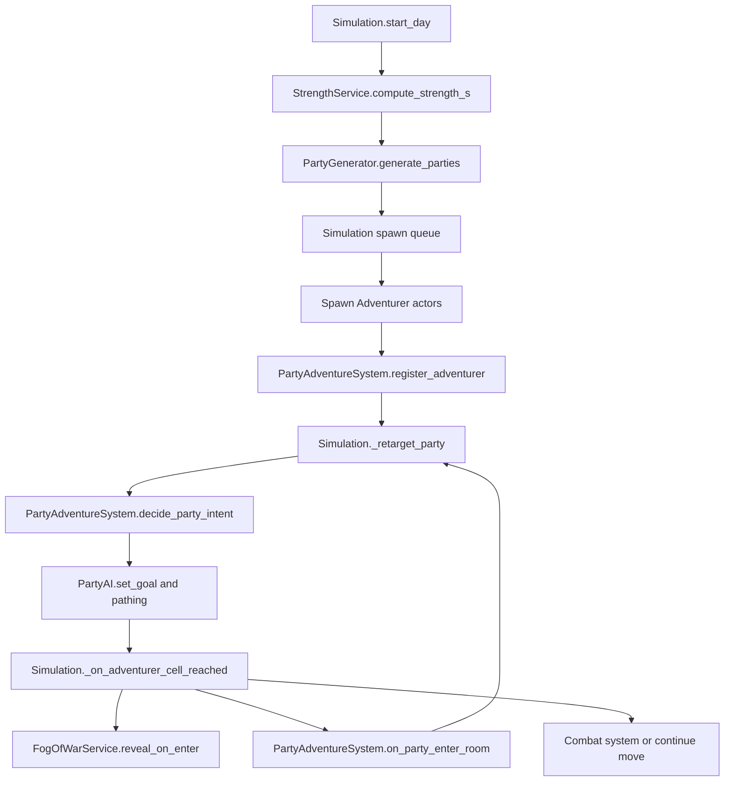

# Adventurer goals + party decision making (system recap)

This document describes the **party/adventurer goal system**, how **morality** affects cohesion/defection, how **fog-of-war** affects intent selection, how **treasure stealing** works, and how **dialogue bubbles** are emitted.

## High-level loop (day start → decisions → movement)

## Where to tune things (the “config”)

The single source of truth for goals/scoring is:
- `autoloads/config_goals.gd`

Key knobs:
- **`GOAL_DEFS`**: one entry per goal id
  - `kind`: `"base"` or `"unique"` (base goals are always given to every adventurer)
  - `spawn_roll`: per-adventurer rolled weight controls
  - `params_roll`: per-adventurer rolled params (e.g. `kills_target`, `loot_target`, `hp_threshold_pct`)
  - `dialogue`: 2–3 one-liners used by bubbles (`pick_dialogue_for_goal`)
- **`INTENT_SCORE`**: intent-level scoring knobs (explore/loot/boss/exit)
  - ex: `base_goal_mult`, `unknown_penalty`, `known_bonus`, `full_loot_exit_bonus`, etc.
- **`INTENT_STABILITY`**: anti-flip-flop knobs
  - `switch_margin`: minimum margin required to switch party intent
  - `clamp_member_min/max`: clamps each member’s contribution before summing

## How to “check the weights” quickly

1) **Spawn-rolled weights/params (per adventurer)** are logged once per day:
- Category: `party`
- Log line: `[party][DEBUG] Adv roll mid=... party=... unique=[...] weights={...} params={...}`
- Emitted by: `scripts/services/PartyGenerator.gd`

2) **Party intent totals** are throttled logs:
- Category: `party`
- Log line: `Party intent pid=... explore=... boss=... loot=... exit=... -> <intent>`
- Emitted by: `scripts/services/PartyAdventureSystem.gd`

3) Log enablement is controlled in:
- `autoloads/DbgLog.gd` (category `"party"` must be enabled at `Level.DEBUG`)

## Adventurer model (brain)

File:
- `scripts/party/AdventurerBrain.gd`

Key fields:
- `morality: int` in \([-5, +5]\)
- `goal_weights: Dictionary` rolled per adventurer
- `goal_params: Dictionary` rolled per adventurer
- `stolen_inv_cap: int` and `stolen_treasure: Array[String]`
- `monsters_killed: int` (progress for kill-count goals)
- Damage/flee state: `took_any_damage`, `flee_triggered`, `flee_delay_rooms_remaining`
- Last HP snapshot (for cautious goal): `last_hp`, `last_hp_max`

## Party structure + decision making

### Party representation
- `scripts/party/PartyState.gd`: party id, member ids, leader, current intent.

### Decision system (intent + goal cell)
Core file:
- `scripts/services/PartyAdventureSystem.gd`

Key responsibilities:
- Track party membership and state (`_party_members`, `_parties`)
- Score intents per member, sum to party totals:
  - `_score_intent_for_member(b, intent, boss_known, loot_known)`
  - `decide_party_intent(party_id)`
- Apply stability:
  - Clamp each member’s score using `config_goals.INTENT_STABILITY`
  - Only switch if new intent beats current by `switch_margin`
- Emit bubble events (queued) for:
  - party intent change (leader speaks)
  - defection (defector speaks)
  - flee trigger (fleeing adv speaks)

### Why those goal ids are “hard-coded”
In scoring you will still see literal goal IDs like:
- `b.goal_weight("kill_boss")`
- `b.goal_weight("loot_dungeon")`
- `b.goal_weight("explore_dungeon")`

Those are **identifiers**, not tuning values. The tuning is in `config_goals.INTENT_SCORE` (multipliers/bonuses/penalties) and `GOAL_DEFS.spawn_roll` (rolled weights).

## Morality and how it changes behavior

Morality lives on each adventurer (`AdventurerBrain.morality`) and influences:

1) **Flee-on-damage delay** (high morality hesitates):
- On damage, `PartyAdventureSystem.on_adv_damaged(...)` sets `took_any_damage`
- If the adventurer has `flee_on_any_damage`, morality may add a room delay:
  - morality ≥ 4: delay 2 rooms
  - morality ≥ 2: delay 1 room
  - else: immediate
- Countdown happens on room entry (`on_party_enter_room`), and triggers via `_trigger_flee`

2) **Exit resistance when fully looted**:
- Goal `exit_when_full_loot` adds a big exit bonus, but subtracts `morality * full_loot_morality_resist_per_point`
- Tuned in: `config_goals.INTENT_SCORE.exit.full_loot_*`

3) **Defection into micro-parties** (low morality = more likely):
- `PartyAdventureSystem._maybe_defect(...)` evaluates members against party intent
- Low morality increases chance to split into a new party (soft-capped)

## Fog-of-war and “unknown room” behavior

Service:
- `scripts/services/FogOfWarService.gd`

Used by:
- `autoloads/Simulation.gd` on room entry (`_fog.reveal_on_enter(...)`)
- `PartyAdventureSystem` when deciding:
  - boss intent gets `unknown_penalty` if boss not known
  - loot intent gets `unknown_penalty` if loot not known

Rendering effect:
- `scripts/DungeonView.gd` draws unknown rooms as hallway-ish and hides special markers.

## Treasure stealing + stash + death drops

Steal on room entry:
- `PartyAdventureSystem.on_party_enter_room(...)` calls `TreasureStealService.steal_from_room(...)`
- Round-robin thief order is based on `_party_members[party_id]`
- Stolen items are stored on the brain (`stolen_treasure`) until death/exit

Exit (successful escape):
- `PartyAdventureSystem.on_adv_exited(...)` moves stolen treasure into `autoloads/StolenStash.gd`

Death:
- `PartyAdventureSystem.on_adv_died(...)` returns stolen ids
- `autoloads/Simulation.gd` spawns them as extra drops via `LootDropSystem.spawn_treasure_drop(...)`

## Dialogue bubbles

World-attached bubble scene:
- `ui/DialogueBubble.tscn` + `ui/DialogueBubble.gd`

Spawner/service:
- `scripts/services/DialogueBubbleService.gd`

Event flow:
- `PartyAdventureSystem` queues events (`_bubble_events`)
- `autoloads/Simulation.gd` drains events (`_drain_party_bubble_events`) and calls `DialogueBubbleService.show_for_actor(...)`

## Combat kill counting (for kill-X goals)

First-pass attribution:
- `autoloads/Simulation_Combat.gd` calls back to `Simulation._on_monster_room_cleared(room_id, adv_ids, killed)` when all monsters die
- `autoloads/Simulation.gd` forwards to `PartyAdventureSystem.on_monster_room_cleared(...)`
- `PartyAdventureSystem` increments `AdventurerBrain.monsters_killed`

