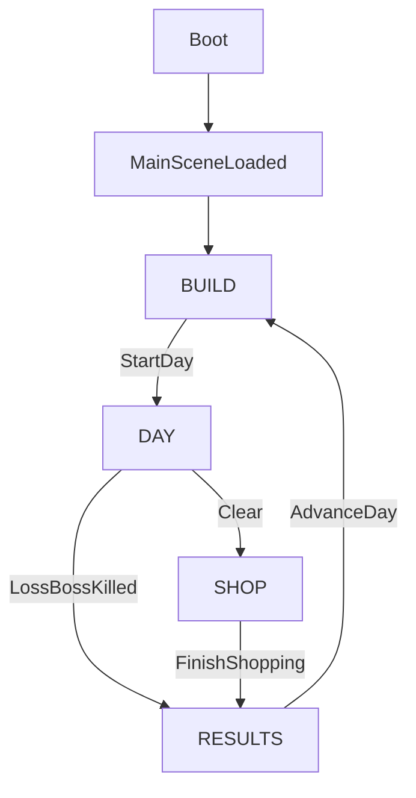

# Gameplay Loop Map (DungeonManager)

This is the 1-page map of the core loop and what data changes at each step.

## Loop diagram (high-level)

## Loop chain with inputs/outputs (what changes)

### Boot → MainSceneLoaded
- **Inputs**: project config (`project.godot` autoloads)
- **Outputs / state changes**:
  - Autoload singletons exist: `GameState`, `DungeonGrid`, `RoomDB`, `ItemDB`, `PlayerInventory`, etc.
  - Main scene initializes UI + hooks simulation/views.
  - Entrance room is auto-placed/forced to a fixed position (layout invariant for the run).

### MainSceneLoaded → BUILD
- **Inputs**: Current `DungeonGrid.rooms`, `PlayerInventory.counts`, config tunables (`game_config`)
- **Outputs / state changes**:
  - `GameState.phase = BUILD`
  - Layout edits allowed (hard rule: only in BUILD).
  - Build-phase UX systems:
    - **Live dungeon validity**: a warning icon appears if setup issues exist (missing boss / not connected), with a hover popup listing issues.
    - **Live placement hint**: while dragging/hovering, placement shows “why not” (overlap, not enough power, out of bounds, unique room already placed).
    - **Tooltips/inspect**: right-click adventurers (BUILD preview) and click rooms to inspect installed slots.
    - **Drag & drop build**:
      - Drag room pieces from the inventory panel to place them.
      - Drag items (monsters/traps/treasure/boss upgrades) onto slots to install them.
      - Right-click removes rooms; right-click on a slot uninstalls the item.
    - **World navigation**: middle-mouse pans; mouse wheel zooms (cursor-centered).
  - Power economy updates:
    - `GameState.power_used` changes based on placed rooms/items (UI-driven).
    - `GameState.power_capacity` is recalculated (includes treasure-room bonuses).
  - Optional: BUILD “preview” can cache the next day’s generation (for determinism + UX).

### BUILD → DAY (“Start Day”)
- **Inputs**:
  - Dungeon validity checks: required rooms and required paths
  - `DungeonGrid.rooms` including installed items in slots
  - `GameState.day_index`
- **Outputs / state changes**:
  - Guarded transition: blocked if missing boss room or no path entrance→boss (and entrance→treasure if treasure exists).
  - `GameState.phase = DAY`
  - Day systems reset: fog, combat state, loot state, monster roster, spawners.
  - Boss is spawned into the boss room; boss upgrades installed in boss room are applied to the boss template/instance.
  - Parties/adventurers for the day are generated (strength-scaled) and spawned on the surface **as multiple parties** (raid feel), then move into the dungeon.

### DAY (inner loops)

#### Surface travel → Dungeon travel
- **Inputs**: party generation, entrance world position, pathfinding over `DungeonGrid`
- **Outputs**:
  - Adventurer actors spawned (runtime entities) across **multiple parties**
  - Per-adventurer tracking: last cell/room, in-combat flag, party id
  - (BUILD only) preview actors may be reused on start-day so the “raid” you saw becomes the actual day run

#### Room entry (repeat)
- **Inputs**: room instance dict (`kind`, `slots[]`, etc.), party/adventurer state
- **Outputs**:
  - **Fog**: room becomes “known” for the day’s exploration logic
  - **Steal**: party may steal treasure on entry; stolen items accumulate on adventurers until exit/death
  - **Trap effects**: on entering trap/boss rooms, trap system may apply damage/effects
  - **Combat join**: entering monster/boss rooms joins combat if monsters exist; combat warmup then attacks tick
  - **Ability triggers**: “enter room”, “attacked”, “attack”, “loot gathered”, “flee”, etc. can fire abilities
  - **Monster spawning** (monster/boss rooms):
    - Spawners are armed from installed monster slots.
    - Spawn rate scales with monster `size` and room `monster_cooldown_per_size`.
    - Spawning pauses while a room is in combat; spawner timers reset on room clear.

#### Combat loop (repeat while monsters present)
- **Inputs**: room combat state, participants, monster roster, threat targeting
- **Outputs**:
  - HP changes for adventurers/monsters; deaths remove actors and may spawn loot
  - Threat weights updated (who monsters target)
  - When all monsters in a room die: combat ends, kill attribution recorded, spawner timers reset
  - If the boss dies: **loss condition** triggers immediately
 - **Feel/behavior notes** (important for tuning):
   - Warmup delay before attacks start (formations slide into place).
   - Threat-based targeting (damage generates threat; threat decays over time; melee emphasizes closeness).
   - Ranged units can “kite” briefly when recently hit (standoff behavior).

#### Exit loop (repeat)
- **Inputs**: party intent (exit) + reaching entrance
- **Outputs**:
  - Adventurer exits the day; stolen treasure moves into stash (meta)
  - **Day event log** records exit reasons / dialogue / loot events (meta) and can be opened via the HUD/Town UI

### DAY end → SHOP (Clear)
- **Inputs**: “all adventurers gone” OR explicit end-day call
- **Outputs / state changes**:
  - Ground loot is collected/animated to the UI target (if any) and credited into inventory
  - `GameState.phase = SHOP`
  - A deterministic shop seed is derived from the day seed

### DAY end → RESULTS (Loss)
- **Inputs**: boss killed
- **Outputs / state changes**:
  - `GameState.phase = RESULTS` (no shop on loss)

### SHOP → RESULTS
- **Inputs**: shop purchases/choices (spend treasure as currency to buy room pieces/items)
- **Outputs**:
  - Player inventories updated (counts by item id)
  - Any meta/history state updated as needed
  - Shop UI notes:
    - Offers reveal via an animated “square” sequence.
    - Hover shows an item popup with offer details.
    - Purchases fly an icon into the relevant inventory tab.

### RESULTS → BUILD (“Advance Day”)
- **Inputs**: result summary (optional), `GameState.day_index`
- **Outputs / state changes**:
  - `GameState.advance_day()` increments day index
  - `GameState.phase = BUILD`
  - Player returns to dungeon editing for the next day

